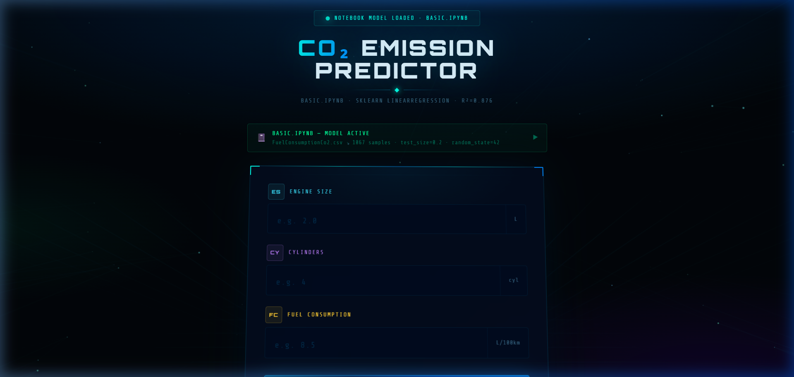

# 🚗 CO2 Emission Predictor — Mission Control UI

A high-performance, futuristic web application designed to predict vehicle carbon emissions using a Scikit-Learn Linear Regression model. This project bridges the gap between raw data science in Jupyter Notebooks and interactive, real-time web visualization.

 *(Note: Placeholder for actual screenshot)*

## 🔬 Core Features

- **Linear Regression Integration**: Directly replicates the calculation logic from `basic.ipynb`, using coefficients and intercept trained on a dataset of 1,067 vehicles.
- **Real-Time Data Processing**: Instant emission calculation based on Engine Size (L), Cylinders, and Fuel Consumption (L/100km).
- **Grading Spectrum**: Categorizes vehicle impact from **A+ (Excellent, <150g/km)** to **F (Critical, >275g/km)**.
- **AI Environmental Analysis**: Integrated with an Anthropic message API to provide customized environmental insights and practical driving tips.
- **Futuristic HUD Design**: A high-fidelity UI inspired by mission control dashes, featuring particle systems, neon grids, and scanline effects.

## 📊 Model Specifications

| Attribute | Value |
|-----------|-------|
| **Algorithm** | Linear Regression (`sklearn.linear_model`) |
| **Dataset** | `FuelConsumptionCo2.csv` (1,067 Samples) |
| **R² Score** | 0.8760 |
| **Training Split** | 80% Train / 20% Test |
| **Intercept** | 39.3484 |

### Prediction Formula:
`CO2 = 39.3484 + (7.2101 × EngineSize) + (6.8437 × Cylinders) + (8.9269 × FuelConsumption)`

## 🛠️ Technology Stack

- **Framework**: [React 19](https://react.dev/)
- **Build Tool**: [Vite 7](https://vite.dev/)
- **Styling**: Vanilla CSS (Custom HUD design system)
- **Fonts**: *Orbitron*, *Rajdhani*, and *Share Tech Mono*.
- **API**: [Anthropic AI API](https://www.anthropic.com/) (for environmental insights).

## 🚀 Getting Started

### Prerequisites
- [Node.js](https://nodejs.org/) (v18 or higher)
- npm (installed with Node)

### Installation
1. Clone the repository or extract the project files.
2. Open your terminal in the `co2-app` directory.
3. Install dependencies:
   ```bash
   npm install
   ```

### Development
Start the development server:
```bash
npm run dev
```
The app will be available at [[http://localhost:5173/](https://co2-app-kappa.vercel.app/)]
## 📁 Project Structure
- `src/App.jsx`: Main application logic, including the calculation engine and UI components.
- `src/index.css`: Global design tokens and foundational resets.
- `public/`: Static assets.
- `vite.config.js`: Build and environment configuration.

## 📜 License
This project is for educational purposes. Data provided by Natural Resources Canada.
